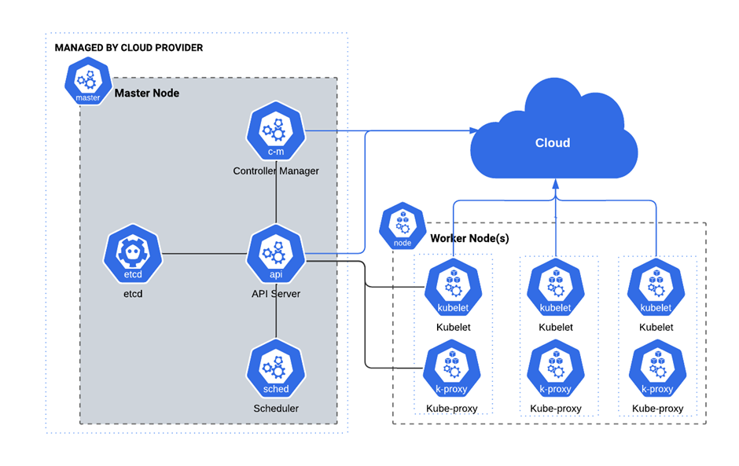

# Componentes da camada de gerenciamento

# kube-apiserver
### O servidor da API é um componente da camada de gerenciamento do Kubernetes que expõe a API do Kubernetes. O servidor da API é o front end para a camada de gerenciamento do Kubernetes.

# etcd
### Armazenamento do tipo chave-valor consistente e de alta-disponibilidade, usado como armazenamento de apoio do Kubernetes para todos os dados do cluster.

# kube-scheduler
### Componente da camada de gerenciamento que observa os Pods recém-criados e que ainda não foram atribuídos a um nó, e seleciona um nó para executá-los.

# kube-controller-manager
>O kube-controller-manager agrupa vários controladores que trabalham juntos para manter o estado desejado dos recursos do cluster.

### Controlador de nó: responsável por perceber e responder quando os nós caem.

### Controlador de Jobs: observa os objetos Job, que representam tarefas únicas, e em seguida cria Pods para executar essas tarefas até a conclusão.

### Controlador de EndpointSlice: preenche o objeto EndpointSlice (conecta os objetos Service e Pod).

### Controlador de ServiceAccount: cria a ServiceAccount default para novos namespaces
---
# Componentes do nó

# kubelet
## Um agente que é executado em cada nó no cluster. Ele garante que os contêineres estejam sendo executados em um Pod.

# kube-proxy
## kube-proxy é um proxy de rede executado em cada nó no seu cluster, implementando parte do conceito de serviço do Kubernetes.

